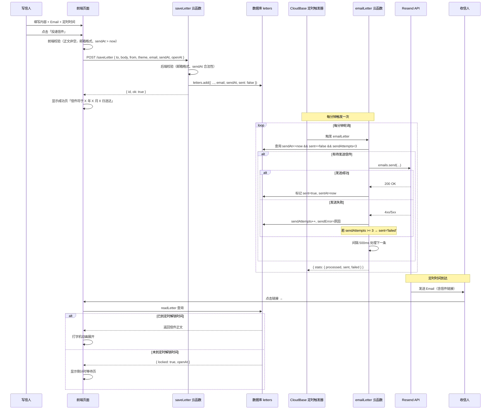
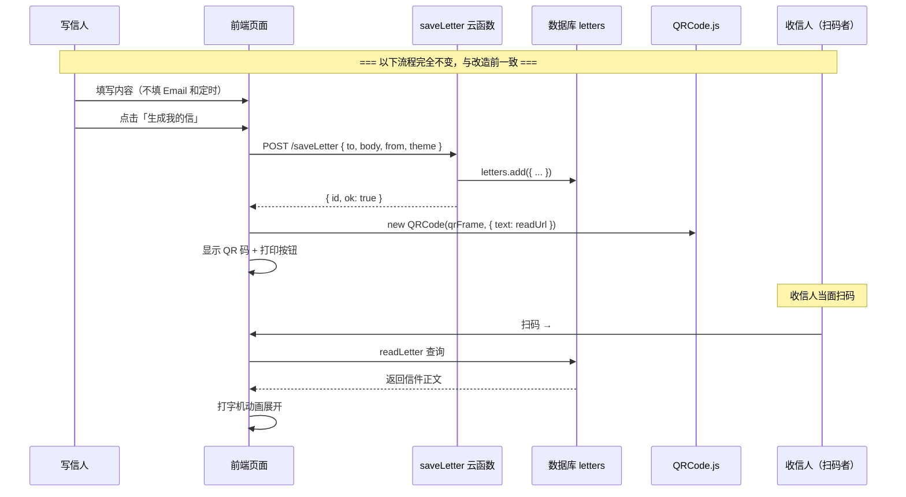

# 架构设计文档 — 寄信（myLetter）定时 Email 投递增量改造

> 作者：高见远（Gao）· 架构师
> 日期：2026-05-11
> 版本：v1.0
> 基于：incremental-prd.md + 现有代码分析

---

## 1. 实现方案概览

### 1.1 总体技术方案

本次改造是**纯后端增量**改造，核心思路：

- **前端（index.html）**：不改动单文件架构。新增 email 字段输入 + 请求体扩展 + UI 层级调整 + 文案更新。原有 QR 生成流程一条不变。
- **后端云函数**：修改 `saveLetter` 扩展字段，新增 `emailLetter` 云函数（Resend API 集成），新增 CloudBase 定时触发器每分钟轮询。
- **数据模型**：`letters` 集合扩展 5 个新字段（email, sendAt, sent, sentAt, sendAttempts, sendError）。
- **读信页**：极小改动——来源标识（Email vs QR）和锁定文案适配。

### 1.2 框架选型

- **纯原生方案，不引入新框架**。
- 前端保持 Vanilla HTML/CSS/JS，单文件。
- 后端保持 `@cloudbase/node-sdk` + Resend SDK（`resend` npm 包）。
- 无需任何构建工具、打包器、前端框架。

### 1.3 核心变更一览

| 变更域 | 变更类型 | 说明 |
|--------|----------|------|
| 写信页 UI | 修改 | 新增 email 输入框、UI 层级重排、文案更新 |
| 提交按钮逻辑 | 修改 | 请求体增加 email/sendAt；区分 Email 模式与 QR 模式成功页 |
| saveLetter 云函数 | 修改 | 接收 email/sendAt 字段写入数据库 |
| emailLetter 云函数 | 新增 | Resend API 集成，定时发送 Email |
| CloudBase 配置 | 新增 | 定时触发器 + 环境变量 RESEND_API_KEY |
| 读信页 | 修改 | 来源标识、锁定文案适配 |
| deleteLetter | 无变更 | — |
| readLetter | 无变更 | — |

---

## 2. 文件列表及相对路径

### 2.1 修改的文件

| 文件路径 | 变更范围 | 预估变更量 |
|----------|----------|-----------|
| `index.html` | ① 新增 email 输入框（含格式校验）；② UI 层级重排（email 前置、QR 折叠）；③ 品牌文案更新；④ 提交成功页区分 Email/QR 两种状态；⑤ 读信页来源标识 + 状态文案适配 | 约 80-120 行 |
| `tencent-cloud/saveLetter/index.js` | ① 解构新增 email/sendAt 字段；② 请求体验证（email 非必填但若有则校验格式）；③ 写入时同步处理 openAt 和 sendAt 的关系 | 约 10-20 行 |

### 2.2 新增的文件

| 文件路径 | 职责 | 说明 |
|----------|------|------|
| `tencent-cloud/emailLetter/index.js` | Email 定时投递云函数 | 查询待发送信件 → Resend API 发送 → 标记状态 |
| `tencent-cloud/emailLetter/package.json` | emailLetter 云函数依赖声明 | 仅包含 `resend` 包 |

### 2.3 新增的配置项（CloudBase 控制台操作，非代码文件）

| 配置项 | 类型 | 说明 |
|--------|------|------|
| 定时触发器 | CloudBase 定时任务 | 每分钟触发 emailLetter 云函数 |
| RESEND_API_KEY | 云函数环境变量 | Resend API 密钥 |
| SENDER_EMAIL | 云函数环境变量 | 发件人邮箱地址（letter@jixinletter.cn）|
| SITE_URL | 云函数环境变量 | 站点根 URL，用于拼接信件链接 |

---

## 3. 数据结构与接口设计

### 3.1 数据模型（letters 集合）

现有字段全部保留不变，新增以下字段（增量标记）：

```javascript
{
  // === 现有字段（全部保留） ===
  _id: String,           // 短 ID（8 位随机字符）
  to: String,            // 收信人名称
  body: String,          // 信件正文（最长 3000 字）
  from: String,          // 署名（写信人名称）
  theme: String,         // 信纸主题: warm | cool | pink | mint
  date: String,          // 写信日期（YYYY-MM-DD 格式）
  expireAt: Date,        // 过期时间（写作时间 + 30 天）
  createTime: Date,      // 数据库写入时间（serverDate）
  openAt: Date,          // 定时解锁时间（已有，可选）

  // === 新增字段（投递相关） ===
  email: String,         // 收信人 Email（可选；不填则无 Email 投递，仅 QR 模式）
  sendAt: Date,          // 定时投递时间（可选；为 null 表示立即投递）
  sent: Boolean|String,  // 发送状态: false=待发送, true=已发送成功, 'failed'=最终失败
  sentAt: Date,          // 实际发送时间
  sendAttempts: Number,  // 已尝试发送次数
  sendError: String      // 最后一次失败原因
}
```

#### 字段约束规则

| 字段 | 约束 |
|------|------|
| `email` | 非必填。若有值则需通过邮箱格式校验（前端 + 后端双重校验） |
| `sendAt` | 可选。若 `email` 有值且 `sendAt` 为 null → 立即投递；若 `email` 为空则忽略此字段 |
| `openAt` | 与 `sendAt` 的**关系**：建议 `sendAt` ≥ `openAt`（即 Email 投递时信件应已可读）。具体由前端控制 |
| `sent` | 默认 `false`。`emailLetter` 发送成功后标记为 `true`，3 次失败后标记为 `'failed'` |

### 3.2 云函数接口变更

#### 3.2.1 saveLetter（修改）

**请求体（POST）：**

```javascript
// 现有字段（全部保留）
{
  to: String,       // 收信人名称（可选）
  body: String,     // 信件正文（必填）
  from: String,     // 署名（可选）
  theme: String,    // 主题（可选，默认 warm）
  date: String,     // 日期（可选，前端计算）
  openAt: String,   // 定时解锁时间 ISO 字符串（可选）

  // 新增字段
  email: String,    // 收信人 Email（可选）
  sendAt: String    // 定时发送时间 ISO 字符串（可选；不传则立即发送）
}
```

**后端校验逻辑追加：**
1. 若 `email` 有值，校验邮箱格式（正则 `/^[^\s@]+@[^\s@]+\.[^\s@]+$/`）
2. 若 `sendAt` 有值，校验为合法未来时间
3. `openAt` 与 `sendAt` 的关系不由后端强校验，由前端逻辑保证

**响应体（无变化）：**

```javascript
{ id: String, ok: true }
```

#### 3.2.2 emailLetter（新增）

**触发器方式**：CloudBase 定时触发器（HTTP 触发模式）

**请求体**：无需传入参数，函数自行查询待发送信件

**响应体：**

```javascript
{
  ok: true,
  stats: {
    processed: Number,   // 本次处理的总信件数
    sent: Number,        // 发送成功数
    failed: Number,      // 发送失败数
    skipped: Number      // 跳过的信件数
  }
}
```

**函数逻辑：**

```
1. 查询 letters 集合中满足以下条件的文档：
   - email 字段不为空（有收件人地址）
   - sent === false（未发送或未尝试发送）
   - sendAt <= now（到达发送时间；sendAt 为 null 的表示立即发送）
   - sendAttempts < 3（已尝试次数 < 3 次）
2. 对每个匹配文档：
   a. sendAttempts++
   b. 调用 Resend API：emails.send({ from, to, subject, html, text })
   c. 成功 → 标记 sent = true, sentAt = now
   d. 失败 → 记录 sendError，若 sendAttempts >= 3 则标记 sent = 'failed'
   e. 两次发送之间间隔至少 500ms（避免触发 Resend 限流）
3. 返回处理统计
```

**Resend API 调用方式：**

```javascript
const { Resend } = require('resend');
const resend = new Resend(process.env.RESEND_API_KEY);

await resend.emails.send({
  from: '寄信 <letter@jixinletter.cn>',
  to: letter.email,
  subject: `${letter.from || '匿名'} 给你写了一封信`,
  html: `<p>${letter.to ? '致 ' + letter.to + '：' : ''}</p>
         <p>你收到了一封来自「寄信」的信件。</p>
         <p><a href="${SITE_URL}/#token/${letter._id}">点击这里阅读</a></p>
         <hr>
         <p style="color:#888;font-size:12px;">寄信 — 寄往未来的某个时刻</p>`,
  text: `${letter.to ? '致 ' + letter.to + '：\n\n' : ''}
你收到了一封来自「寄信」的信件。
打开链接阅读：${SITE_URL}/#token/${letter._id}

寄信 — 寄往未来的某个时刻`
});
```

#### 3.2.3 readLetter（无变更）

保持现有逻辑不变：
- 查询文档 → 检查 expireAt → 检查 locked（openAt > now）→ 返回信件内容
- 新增的 `email`/`sendAt`/`sent` 等字段不返回给前端，避免泄露内部状态

#### 3.2.4 deleteLetter（无变更）

保持现有逻辑不变。

---

## 4. 程序调用流程

### 4.1 Email 写信 → 定时发送 → 收信全流程



### 4.2 QR 写信保留流程（无变更）



---

## 5. 任务列表（按实现顺序排列）

### 任务依赖图

```
T1 (前端 UI) ──→ T4 (成功页适配)
     │
     └──→ T2 (saveLetter 修改) ──→ T3 (emailLetter 新增) ──→ T5 (CloudBase 配置)
                                        │
                                        └──→ T6 (读信页修改)
                                        └──→ T7 (QA 测试)
```

### 任务详情

---

#### T1：前端写信页新增 email 字段 + UI 重排 + 文案更新

| 属性 | 内容 |
|------|------|
| **文件名** | `index.html`（HTML 结构 + CSS + JS） |
| **依赖** | 无（可最先开始） |
| **完成标准** | ⬜ 新增 Email 输入框，位于「收信人姓名」下方，带格式校验 ⬜ 投递时间选择器文案从「送达时间」改为「投递时间」，选项不变 ⬜ 品牌文案更新：标题/副标题/口号 ⬜ 提交按钮文案从「生成我的信」改为「投递信件」 ⬜ 发送请求体包含 `email`、`sendAt` 字段 ⬜ UI 层级调整：email 输入框为写页面眼，QR 生成停留在成功页但不再是唯一结果 |
| **具体变更** | |
| HTML | 在 `#letterTo` 下方新增 `<div class="field-group">` 含 Email input（type="email"） |
| CSS | 无需新增样式，复用 `.field-group` 已有样式 |
| JS | ① 新增邮箱格式校验函数 `isValidEmail()`；② 修改 `checkValid()` 当 email 非空时验证格式；③ 修改请求体构建：`letter.email`、`letter.sendAt`；④ 修改按钮文案逻辑（区分 Email 模式和 QR 模式） |
| 文案更新 | ① `h1` 改为「寄信」；② `.sub` 改为「寄往未来的某个时刻」；③ Slogan 改为「寄信 — 寄往未来的某个时刻」 |
| **注意** | Email 为**可选**字段。不填 email 时走完整 QR 生成流程，与改造前一致 |

---

#### T2：saveLetter 云函数修改

| 属性 | 内容 |
|------|------|
| **文件名** | `tencent-cloud/saveLetter/index.js` |
| **依赖** | 无（可独立修改，推荐在 T1 之后部署测试） |
| **完成标准** | ⬜ 解构新增字段 `email`、`sendAt` ⬜ 若 `email` 有值则校验邮箱格式 ⬜ 写入数据库时包含新增字段 ⬜ `sent` 默认 `false`，`sendAttempts` 默认 `0` ⬜ 返回数据不变 |
| **代码变更** | |
| 第 40 行 | 改为 `const { to, body: letterBody, from, theme, date, openAt, email, sendAt } = data;` |
| 新增校验 | `if (email && !/^[^\s@]+@[^\s@]+\.[^\s@]+$/.test(email)) return response({ error: 'Invalid email' }, 400);` |
| 第 49-58 行 `doc` | 追加 `email: email || ''`、`sendAt: sendAt ? new Date(sendAt) : null`、`sent: false`、`sendAttempts: 0` |
| **注意** | `sendAt` 和 `openAt` 的关系不在后端校验；`sendAt` 为 null 表示立即发送 |

---

#### T3：新增 emailLetter 云函数

| 属性 | 内容 |
|------|------|
| **文件名** | `tencent-cloud/emailLetter/index.js`（新建）<br>`tencent-cloud/emailLetter/package.json`（新建） |
| **依赖** | T2（需 saveLetter 已能写入新字段） |
| **完成标准** | ⬜ 函数能正确查询待发送信件（sendAt <= now && sent == false && sendAttempts < 3） ⬜ 调用 Resend API 发送 Email（HTML + 纯文本双版本） ⬜ 发送成功标记 sent=true + sentAt ⬜ 发送失败标记 sendAttempts++ + sendError，3 次失败后 sent='failed' ⬜ 两次发送之间有 500ms 间隔 ⬜ 返回处理统计 ⬜ package.json 声明 `resend` 依赖 ⬜ 函数可通过 HTTP 调用方式手动测试 |
| **代码结构** | |

```javascript
const tcb = require('@cloudbase/node-sdk');
const { Resend } = require('resend');

const app = tcb.init({ env: tcb.SYMBOL_CURRENT_ENV });
const db = app.database();

const resend = new Resend(process.env.RESEND_API_KEY);
const SITE_URL = process.env.SITE_URL;       // 如 https://your.domain.com
const SENDER_EMAIL = process.env.SENDER_EMAIL; // letter@jixinletter.cn

function response(data, statusCode = 200) {
  return {
    statusCode,
    headers: { 
      'Access-Control-Allow-Origin': '*',
      'Content-Type': 'application/json'
    },
    body: JSON.stringify(data)
  };
}

exports.main = async (event, context) => {
  if (event.httpMethod === 'OPTIONS') return response({}, 200);

  const stats = { processed: 0, sent: 0, failed: 0, skipped: 0 };

  try {
    const now = new Date();
    const { data: letters } = await db.collection('letters')
      .where({
        email: db.command.neq(''),
        sent: false,
        sendAttempts: db.command.lt(3),
        sendAt: db.command.lte(now)
      })
      .get();

    if (!letters || letters.length === 0) {
      return response({ ok: true, stats });
    }

    stats.processed = letters.length;

    for (let i = 0; i < letters.length; i++) {
      const letter = letters[i];
      
      // Increment attempt count
      await db.collection('letters').doc(letter._id)
        .update({ sendAttempts: db.command.inc(1) });

      try {
        await resend.emails.send({
          from: `寄信 <${SENDER_EMAIL}>`,
          to: letter.email,
          subject: `${letter.from || '匿名'} 给你写了一封信`,
          html: buildHtml(letter, SITE_URL),
          text: buildText(letter, SITE_URL)
        });

        await db.collection('letters').doc(letter._id)
          .update({
            sent: true,
            sentAt: now,
            sendError: ''
          });
        stats.sent++;
      } catch (err) {
        const newAttempts = (letter.sendAttempts || 0) + 1;
        const update = {
          sendError: err.message,
          sendAttempts: newAttempts
        };
        if (newAttempts >= 3) update.sent = 'failed';
        await db.collection('letters').doc(letter._id).update(update);
        stats.failed++;
      }

      // Rate limiting: 500ms between sends
      if (i < letters.length - 1) {
        await new Promise(r => setTimeout(r, 500));
      }
    }

    return response({ ok: true, stats });
  } catch (e) {
    return response({ error: e.message }, 500);
  }
};

function buildHtml(letter, siteUrl) { /* HTML email template */ }
function buildText(letter, siteUrl) { /* Plain text email template */ }
```

**package.json：**

```json
{
  "name": "emailLetter",
  "version": "1.0.0",
  "dependencies": {
    "resend": "^4.0.0"
  }
}
```

---

#### T4：成功提交页区分 Email/QR 两种状态

| 属性 | 内容 |
|------|------|
| **文件名** | `index.html`（JS 部分） |
| **依赖** | T1（前端字段就绪）、T2（后端就绪） |
| **完成标准** | ⬜ Email 模式下（`email` 有值）：成功页主文案为「信件已投递」，显示「信件将于 X 年 X 月 X 日 XX:XX 送达至 xxx@xxx.com」 ⬜ QR 模式下（`email` 无值）：保留原有 QR 码、打印按钮、「再写一封」等 ⬜ 两种模式下都保留「再写一封」和「销毁」按钮 ⬜ 文案清晰区分两种状态，不给用户造成困惑 |
| **具体变更** | 修改 `btnGenerate` 点击回调中结果展示逻辑：`if (letter.email)` 判断分支 |

---

#### T5：CloudBase 定时触发器 + 环境变量配置

| 属性 | 内容 |
|------|------|
| **操作路径** | CloudBase 控制台 |
| **依赖** | T3（emailLetter 云函数已创建） |
| **完成标准** | ⬜ 创建定时触发器，每分钟触发一次 emailLetter ⬜ 配置环境变量 `RESEND_API_KEY`、`SENDER_EMAIL`、`SITE_URL` ⬜ 手动触发验证一次，确认能正确调用 |
| **具体操作** | 1. CloudBase 控制台 → 云函数 → emailLetter → 触发器 → 新建定时触发器 ⬜ 2. Cron 表达式：`0 */1 * * * * *`（每分钟） ⬜ 3. 环境变量 → 新增 ⬜ 4. 点击「测试」手动触发验证 |
| **注意** | CloudBase 定时触发器在免费版中可能受限。如不可用，见第 8 节替代方案 |

---

#### T6：读信页来源标识 + 锁定状态文案适配

| 属性 | 内容 |
|------|------|
| **文件名** | `index.html`（HTML + JS 读信部分） |
| **依赖** | T1（前端结构）、T2（后端已返回新字段） |
| **完成标准** | ⬜ 读信页显示来源标识：「这封信于 X 年 X 月 X 日寄达你的邮箱」或「当面送达」 ⬜ 锁定状态文案调整适配新定位 |
| **具体变更** | 从 `readLetter` 返回的数据推断来源方式：如果 `data.email` 存在 → 来源为 Email；否则为 QR。在信件顶部 `.letter-meta` 区域显示来源标识。锁定状态页面文案微调 |

---

#### T7：QA 测试阶段

| 属性 | 内容 |
|------|------|
| **涉及文件** | 所有变更文件 |
| **依赖** | T1~T6 全部完成 |
| **完成标准** | |

**测试用例清单：**

| 编号 | 场景 | 前置条件 | 验证点 |
|------|------|----------|--------|
| TC-01 | Email 立即发送 | 填写 email + 正文 + 选择「立即发送」 | saveLetter 写入数据，emailLetter 一次触发后标记 sent=true |
| TC-02 | Email 定时发送 | 填写 email + 选择「3天后」 | sendAt 正确写入，读信页锁定倒计时正常 |
| TC-03 | QR 模式（不填 email）| 不填 email，填正文 | 走完整 QR 生成流程，无 Email 相关操作 |
| TC-04 | Email 格式校验 | 输入非法 email | 前端/后端校验阻止提交 |
| TC-05 | 空正文提交 | 不填正文 | 按钮禁用，无法提交 |
| TC-06 | 定时到期自动投递 | sendAt 设置为过去时间 | 下次定时触发时正确发送 |
| TC-07 | Email 发送失败重试 | 模拟 Resend API 返回错误 | 累加 sendAttempts，3 次后标记 failed |
| TC-08 | 读信页来源标识 | 分别通过 Email 和 QR 打开 | 显示正确的来源标识 |
| TC-09 | 信件销毁 | 点击销毁按钮 | Email 模式 + QR 模式均正常销毁 |
| TC-10 | 并发发送 | 同一批次有 5+ 封待发 | 500ms 间隔正常，无发送冲突 |

---

## 6. 依赖包列表

| 包名 | 版本 | 用途 | 部署位置 |
|------|------|------|----------|
| `resend` | ^4.0.0 | Resend API JavaScript SDK | `tencent-cloud/emailLetter/` |
| `@cloudbase/node-sdk` | 已有 | CloudBase 数据库 SDK | 所有云函数（已有，无需新增） |
| `qrcodejs` | 已有 | QR 码生成（CDN 引用） | 前端（已有，无变更） |

> **重要**：无需新增前端依赖。`resend` 仅在后端云函数中使用。

---

## 7. 共享知识（跨文件约定）

### 7.1 字段命名规范

| 字段 | 命名规则 | 说明 |
|------|----------|------|
| `email` | 全小写，统一用 `email`（而非 `eMail`/`mailTo`）| 前端 → saveLetter → 数据库 保持一致性 |
| `sendAt` | camelCase，JS Date ISO 字符串 | 前端传 ISO 字符串，后端存 Date 对象 |
| `sent` | Boolean 或 String `'failed'` | 三态：`false`=待发送, `true`=成功, `'failed'`=失败 |
| `sendAttempts` | camelCase，Number | 初始 0，递增到 3 停止 |
| `sendError` | camelCase，String | 存最后一次错误消息原文 |

### 7.2 环境变量名

| 变量名 | 用途 | 示例值 |
|--------|------|--------|
| `RESEND_API_KEY` | Resend API 认证密钥 | `re_xxxxxxxxxxxx` |
| `SENDER_EMAIL` | 发件人邮箱地址 | `letter@jixinletter.cn` |
| `SITE_URL` | 站点根 URL（不含尾斜杠） | `https://myletter.example.com` |

### 7.3 Email 模板 HTML 变量命名

```javascript
// HTML 模板中使用的变量
const htmlVars = {
  recipientName: letter.to,       // 收信人称呼（可能为空）
  senderName: letter.from,        // 写信人署名（可能为 '匿名'）
  letterUrl: `${SITE_URL}/#token/${letter._id}`,  // 信件链接
  brandName: '寄信',
  brandSlogan: '寄往未来的某个时刻'
};
```

### 7.4 关键逻辑约定

1. **前端传 ISO 字符串，后端转 Date 对象**。所有时间字段（`openAt`、`sendAt`、`date`）统一此规则。
2. **Email 非必填**。不填 = QR 模式，填了 = Email 模式（可同时生成 QR 作为补充）。
3. **QR 模式不设定时**。如果用户不填 email，`sendAt` 不应有意义，后端写入时忽略此字段。
4. **读信页不返回 email/sendAt/sent 等内部字段**，避免暴露发送状态给收信人。

---

## 8. 待明确事项

### Q1：CloudBase 定时触发器（cron）支持情况

**核心问题**：CloudBase 是否支持原生定时触发器来每分钟调用云函数？

**已知信息**：
- CloudBase 云函数支持「定时触发器」（Timer Trigger），可通过 Cron 表达式配置。
- 免费版定时触发器调用次数和频率可能受限。

**建议**：
1. **首选方案**：使用 CloudBase 控制台配置定时触发器，Cron 表达式 `*/1 * * * * *`，直接触发 `emailLetter` 云函数。这是最省力的方案。
2. **备选方案**：如果 CloudBase 定时触发器不可用或受限，使用外部定时服务：
   - **方案 A**：GitHub Actions — 部署一个简单的 Action，每分钟（或每 5 分钟）通过 HTTP 调用 emailLetter 云函数的公网 URL。
   - **方案 B**：Vercel Cron Jobs — 如果前端部署在 Vercel，可以利用 Vercel 的 Cron Jobs 功能。
   - **方案 C**：自建轻量定时器 — 在另一台低配服务器上跑一个 cron job，curl 调用云函数。

**决策截止**：需要在开发 T3（emailLetter）之前确认此项，因为触发器方式会影响 emailLetter 的入口参数设计（HTTP 模式 vs 事件模式）。

### Q2：Resend 账户注册与域名验证

**状态**：待确认。
- 需要注册 Resend 账户（resend.com）
- 验证域名 `jixinletter.cn` 的所有权（DNS TXT 记录）
- 配置 SPF/DKIM 以提升邮件送达率

### Q3：Email 定时发送与解锁时间的关系

前端逻辑中需要明确：
- 选择「定时发送」时，是否自动设置 `openAt` = `sendAt`（即 Email 到达时信件正好解锁）？
- 如果用户同时填写了 email 和另选了自定义 `openAt`，两者时间如何处理？

**建议方案**：前端默认 `openAt = sendAt`。用户可通过高级选项单独调整。简化版本中直接对齐。

### Q4：域名 jixinletter.cn 可用性

PRD 中提及的域名 `jixinletter.cn` 为本次发件人邮箱域名。需要确认：
- 域名是否已注册？
- DNS 是否已指向当前 CloudBase 服务？
- 是否能配置 Resend 所需的 MX/SPF/DKIM 记录？

### Q5：定时触发频率

每分钟轮询一次对于 MVP 阶段足够充裕。如果未来需精确到秒级发送，可调整为每 30 秒或采用事件驱动方案（如使用消息队列）。

### Q6：安全性考虑

当前系统使用 8 位随机字符作为 token（`Math.random().toString(36).substring(2, 10)`），空间约 2.8 万亿，暴力碰撞概率极低。此次改造不改变 token 生成逻辑，安全性保持现有水平。

---

## 附录：开发时间估算（仅供参考）

| 任务 | 估算工时 | 说明 |
|------|----------|------|
| T1 前端 UI 修改 | 2-4h | 含样式微调、JS 校验逻辑 |
| T2 saveLetter 修改 | 0.5-1h | 字段扩展、校验 |
| T3 emailLetter 新建 | 3-5h | 含 Resend 包集成、模板设计 |
| T4 成功页适配 | 1-2h | UI 条件渲染 |
| T5 CloudBase 配置 | 0.5h | 纯配置工作 |
| T6 读信页适配 | 1-2h | 来源标识、文案 |
| T7 QA 测试 | 2-3h | 手工 + 边界测试 |
| **合计** | **10-17.5h** | |
